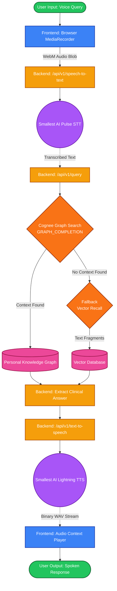

# Pulse - Stateful AI Health Assistant

Pulse is an intelligent, voice-driven health assistant that solves the "statefulness" problem in modern digital health. While most AI assistants require patients to repeat their history, symptoms, and medications every session, Pulse leverages **Cognee** to build a persistent, personalized medical memory graph.

## Why Pulse? (The Cognee Advantage)

Instead of relying on population averages or stateless LLM wrappers, Pulse narrows the focus to what is most realistically buildable and impactful: **symptom-trigger-treatment mapping**. 

By utilizing Cognee Cloud's Graph RAG pipelines, Pulse offers the following benefits:
1. **Personalized Memory**: The system remembers your specific history (e.g., that *your* migraines are triggered by *your* stress levels and alleviated by *your* specific medication).
2. **Medical Ontologies**: Cognee ingests raw text and maps it into a structured graph consisting of `Symptom`, `Trigger`, `Medication`, `TreatmentOutcome`, and `LifestyleFactor` nodes.
3. **Graph Reasoning (`GRAPH_COMPLETION`)**: When queried, Pulse doesn't just do a vector search; it uses Cognee's `GRAPH_COMPLETION` search type to perform graph traversals and LLM reasoning to construct comprehensive answers based entirely on your ingested context.
4. **Data Lifecycle (`/forget`)**: A clean `/api/v1/forget` implementation ensures that you can wipe your personal graph and start fresh at any time, maintaining strict data sovereignty.

## Clinical & Design Philosophy: The Stateful Memory Problem

### The Statefulness Crisis in Digital Health
Health assistants today are largely **stateless**. During every clinical interaction or chat session, a patient is forced to repeat their medical history, chronic symptoms, active medications, and lifestyle context. Current LLM-based assistants treat every conversation as a fresh context window, meaning the system never learns from the patient's individual patterns across time.

### The Pulse Core Insight
While a lifelong memory tracking all electronic health records, lab reports, emotional states, environmental variables, and treatment outcomes is the ideal vision, real EHR data is highly protected, unstructured, and scattered. 

**Pulse** narrows this lifelong memory concept to the slice that is both the most **Cognee-native** and the most realistically buildable: **symptom-trigger-treatment mapping**. 

Rather than relying on population averages, Pulse builds a personalized, stateful clinical memory graph that learns:
1. What **specific triggers** (e.g., high stress, poor sleep) cause or worsen a person's symptoms.
2. What **specific treatments/medications** actually work to alleviate symptoms for *this specific individual*.

## System Architecture & Data Flow

### Comprehensive Process Flow Chart



### Component Breakdown

1. **Frontend (UI Layer)**: Handles capturing user microphone input and parsing/playing the binary WAV audio returned by the backend.
2. **Backend (Gateway Layer)**: A FastAPI routing layer that manages API keys, parses JSON/FormData, and orchestrates calls between the Cognitive APIs.
3. **Cognitive Cloud Layer**: 
    - **Smallest AI**: Provides high-speed Speech-to-Text and Text-to-Speech capabilities, creating a natural voice interface.
    - **Cognee Cloud**: Maintains the stateful medical graph, allowing the application to reason over historical, personalized medical data using `GRAPH_COMPLETION`.

## Project Structure & Setup

The repository contains two main directories:
- `backend/` (FastAPI, Python)
- `frontend/` (React, TypeScript, Vite, TailwindCSS)

### 1. Backend Setup
The backend serves as the API Gateway communicating with Cognee Cloud and Smallest AI.

```bash
cd backend

# Create and activate a virtual environment
python -m venv .venv
source .venv/bin/activate  # On Windows use: .venv\Scripts\activate

# Install dependencies
pip install -r requirements.txt

# Create a .env file and add your keys
echo "COGNEE_API_KEY=your_cognee_key" >> .env
echo "SMALLEST_API_KEY=your_smallest_ai_key" >> .env

# Run the FastAPI server
uvicorn app.main:app --reload --port 8000
```

### 2. Frontend Setup
The frontend is a modern React application utilizing TailwindCSS for premium styling.

```bash
cd frontend

# Install dependencies
npm install

# Run the development server
npm run dev
```

## Dashboard Functionalities

The application is structured into three primary pages:

### 1. Upload & Settings (`/upload`)
- **Ingestion**: Upload a PDF or Text file containing a patient's diary or clinical history. This calls `/api/v1/process-pdf` which uploads the file to Cognee via `/api/v1/remember`, mapping the unstructured text to the custom medical ontology.
- **Dataset Reset**: A "Reset / Clear Existing Cognee Memory Graph" button calls the backend to trigger Cognee's `/api/v1/forget` endpoint, completely wiping the patient's dataset.

### 2. Trends Dashboard (`/trends`)
- **Data Visualization**: A comprehensive, beautifully styled dashboard (mirroring professional medical tech aesthetics).
- **Widgets**:
  - A dual-line/area gradient graph showing Health Heart Rate & Energy Burn over time.
  - A concentric donut chart depicting a breakdown of daily time (Sleep, Light Activity, Active Zones).
  - Four colorful summary metric cards displaying Stress Index, Steps Count, Sleep Rating, and Active Duration.
  - A clinical records status table summarizing the processing of recent logs.

### 3. Voice-to-Voice Graph Chat (`/graph`)
- **Speech-to-Speech Flow**: Hold the Microphone button to record a query. The frontend sends the WebM audio to the backend.
- **Smallest AI Integration**: The backend uses Smallest AI's Pulse model to transcribe the audio into text (`/api/v1/speech-to-text`).
- **Graph RAG**: The backend queries Cognee (`/api/v1/query`) using `GRAPH_COMPLETION` search to get an answer grounded purely in your personal medical graph.
- **Voice Playback**: The text answer is sent to Smallest AI's Lightning TTS model (`/api/v1/text-to-speech`) to generate a WAV file, which is streamed back and played automatically in the browser.

## Backend Endpoints

- `POST /api/v1/process-pdf`: Uploads a document to Cognee Cloud (`/api/v1/remember`) alongside the custom JSON graph schema to populate the memory graph.
- `DELETE /api/v1/reset-dataset`: Invokes Cognee's `POST /api/v1/forget` to wipe the patient's knowledge graph dataset.
- `POST /api/v1/speech-to-text`: Forwards client audio to Smallest AI's Pulse STT endpoint.
- `POST /api/v1/query`: Queries Cognee using `GRAPH_COMPLETION` search (with a fallback to vector `recall`) to answer medical questions using graph reasoning.
- `POST /api/v1/text-to-speech`: Synthesizes response text using Smallest AI's Lightning v3.1 Pro model (Meher voice) and streams back WAV audio bytes.

## Functional Breakdown & Importance

### `transcribe_audio` (Smallest AI Pulse STT)
*   **Technical Importance**: Replaces stateless text entry with voice capability. Using the high-speed **Pulse** model, it transcribes the user's speech audio with punctuation and word alignments.
*   **Value Add**: Allows patients to naturally explain complex symptoms in real time without keyboard overhead.

### `query` (Cognee Graph Search)
*   **Technical Importance**: Uses a two-tier retrieval strategy. First, it triggers `/api/v1/search` with the **`GRAPH_COMPLETION`** search type. If the query yields no result, it falls back to `/api/v1/recall` (vector chunk retrieval).
*   **Value Add**: Unlike stateless LLMs that answer based on general medical advice, this queries the patient's individual clinical graph. Answers match their personal history (e.g. knowing that *their* migraine is triggered by *their* sleep deprivation and alleviated by *their* magnesium dosage).

### `text_to_speech` (Smallest AI Lightning TTS)
*   **Technical Importance**: Calls the unified `/waves/v1/tts` endpoint using the `"lightning_v3.1_pro"` model. Uses the premium voice `"meher"` to render clinical feedback into audio.
*   **Value Add**: Creates a seamless, hands-free conversational loop.

### `reset_dataset` (Cognee Forget)
*   **Technical Importance**: Calls the official `POST /api/v1/forget` REST endpoint. This deletes all nodes, properties, and relationships scoped to `self.dataset` inside Cognee Cloud.
*   **Value Add**: Enables dataset lifecycle compliance. When a patient decides to wipe their profile or start over with fresh records, the system physically destroys their graph instead of just ignoring it.

## Schema Specifications & API Contracts

### Custom Medical Ontology (Cognee Ingestion Schema)
Sent in the `graph_model` field of `/api/v1/remember` to instruct Cognee's chunkers and ontologies to index the raw medical text into specific graph nodes:

```json
{
  "title": "MedicalPatientKnowledgeGraph",
  "nodes": [
    { "name": "Symptom", "properties": ["name", "severity", "frequency"] },
    { "name": "Trigger", "properties": ["name", "category"] },
    { "name": "Medication", "properties": ["name", "dosage", "frequency"] },
    { "name": "TreatmentOutcome", "properties": ["description", "efficacy"] },
    { "name": "LifestyleFactor", "properties": ["name", "frequency", "value"] }
  ],
  "relationships": [
    { "from": "Trigger", "to": "Symptom", "type": "TRIGGERS" },
    { "from": "Medication", "to": "Symptom", "type": "ALLEVIATES" },
    { "from": "Medication", "to": "TreatmentOutcome", "type": "PRODUCES" },
    { "from": "LifestyleFactor", "to": "Symptom", "type": "AFFECTS" },
    { "from": "Symptom", "to": "TreatmentOutcome", "type": "HAS_OUTCOME" }
  ]
}
```
