# Pulse: Premium System Architecture

This customized dark-mode architectural map visually highlights the critical data pathways. The **Crimson Pathways** trace the real-time Speech-to-Speech loop through the system, while the **Dashed Grey Pathways** represent asynchronous fetching and dashboard UI updates.

## Critical Path Architecture Diagram

```mermaid
graph TD
    %% Custom Geometric Shapes & Dark Mode Palette
    classDef react fill:#0f172a,stroke:#38bdf8,stroke-width:2px,color:#e2e8f0,rx:8,ry:8;
    classDef fastapi fill:#0f172a,stroke:#10b981,stroke-width:2px,color:#e2e8f0,rx:8,ry:8;
    classDef service fill:#0f172a,stroke:#f59e0b,stroke-width:2px,color:#e2e8f0,rx:12,ry:12;
    classDef db fill:#0f172a,stroke:#ec4899,stroke-width:2px,color:#e2e8f0;
    classDef cloud fill:#0f172a,stroke:#8b5cf6,stroke-width:2px,color:#e2e8f0,rx:20,ry:20;
    classDef user fill:#0f172a,stroke:#94a3b8,stroke-width:2px,color:#e2e8f0,rx:20,ry:20;

    %% Global Backgrounds (Dark Mode Aesthetic)
    style Frontend fill:#1e293b,stroke:#334155,stroke-width:2px,rx:15,ry:15;
    style Gateway fill:#1e293b,stroke:#334155,stroke-width:2px,rx:15,ry:15;
    style Services fill:#1e293b,stroke:#334155,stroke-width:2px,rx:15,ry:15;
    style Clouds fill:#1e293b,stroke:#334155,stroke-width:2px,rx:15,ry:15;

    Patient((🧑‍⚕️ Patient)):::user

    subgraph Frontend [📱 Client Layer - React Frontend]
        direction LR
        P_Dash>📊 Dashboard View]:::react
        P_Chat>💬 Graph Voice Chat]:::react
        P_Settings>⚙️ Upload & Setup]:::react
    end

    Patient -. "Views Trends" .-> P_Dash
    Patient == "Speaks & Listens" ==> P_Chat
    Patient -. "Uploads Records" .-> P_Settings

    subgraph Gateway [⚡ API Layer - FastAPI Routers]
        direction LR
        R_Insights([POST /insights]):::fastapi
        R_STT([POST /speech-to-text]):::fastapi
        R_Query([POST /query]):::fastapi
        R_TTS([POST /text-to-speech]):::fastapi
    end

    P_Dash -. "Fetch Health Plan" .-> R_Insights
    P_Chat == "1. WebM Audio" ==> R_STT
    P_Chat == "3. Text Query" ==> R_Query
    R_TTS == "6. WAV Audio" ==> P_Chat

    subgraph Services [⚙️ Service Layer - Business Logic]
        direction LR
        S_Insights[[💡 Insights Service]]:::service
        S_Smallest[[🎙️ Smallest AI Wrapper]]:::service
        S_Graph[[🧠 Graph RAG Service]]:::service
    end

    R_Insights -.-> S_Insights
    R_STT ==> S_Smallest
    R_TTS ==> S_Smallest
    R_Query ==> S_Graph

    S_Insights -. "Fetches History" .-> S_Graph

    subgraph Clouds [☁️ External Cloud & Data Layer]
        direction LR
        Groq{{🧠 Groq Llama 3}}:::cloud
        Cognee[(🕸️ Cognee Memory Graph)]:::db
        Smallest{{⚡ Smallest AI APIs}}:::cloud
    end

    S_Insights -. "Generates Plan" .-> Groq
    S_Graph == "4. Graph Traversal" ==> Cognee
    S_Smallest == "2. STT / 5. TTS" ==> Smallest

    %% Link styles for high contrast
    linkStyle 0,2,3,7,11,12 stroke:#94a3b8,stroke-width:2px,stroke-dasharray: 5 5;
    linkStyle 1,4,5,6,8,9,10,13,14 stroke:#f43f5e,stroke-width:3px;
```

### Aesthetic Enhancements Included:
- **Neon Dark Mode**: Replaced the white boxes with deep slate and slate-blue bounds, making the vibrant neon border colors (Emerald, Pink, Violet, Amber) pop incredibly well.
- **Visual Shapes**: Used distinct geometric boundaries. The UI views are "flags", the APIs are "pills", the services are "subroutines", and the clouds are "hexagons".
- **Data Trace Routing**: The system maps the entire primary user experience via a thick crimson trace, so viewers can track the exact chronological order of the 6-step Speech-to-Speech loop.
